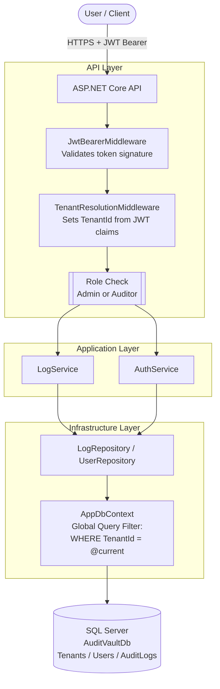

# AirMark — Secure Multi-Tenant Audit Vault (POC)

A RESTful API for securely storing and retrieving compliance audit logs across multiple isolated tenants.
Built with **ASP.NET Core 8**, **Entity Framework Core**, and **SQL Server Express**.

---

## Architecture Diagram



**Request flow:**
1. Client sends request with `Authorization: Bearer <jwt>`
2. `JwtBearerMiddleware` validates the token signature and expiry
3. `TenantResolutionMiddleware` extracts `tenantId`, `userId`, `role` claims into the scoped `ICurrentTenantService`
4. ASP.NET Core `[Authorize(Roles="...")]` enforces RBAC
5. Controller delegates to the service layer
6. Repository queries EF Core — the **global query filter** automatically appends `WHERE TenantId = @tenantId` to every `AuditLog` query, preventing cross-tenant data leakage

---

## Database Schema

```sql
Tenants   (Id, Name, CreatedAt)
Users     (Id, TenantId FK, Email, PasswordHash, Role, CreatedAt)
AuditLogs (Id, TenantId FK, UploadedBy FK, EventType, Payload NVARCHAR(MAX), CreatedAt)
```

**Design decisions:**
- `TenantId` is a first-class column on both `Users` and `AuditLogs` — every query enforces it
- `Payload` stored as `NVARCHAR(MAX)` JSON (SQL Server compatible; PostgreSQL would use `JSONB`)
- All PKs are `GUID` to prevent enumeration attacks
- Indexes on `AuditLogs.TenantId` and `AuditLogs.CreatedAt` for efficient paginated queries

---

## Prerequisites

| Tool | Version |
|---|---|
| Visual Studio 2022 | 17.x (Community or higher) |
| .NET SDK | 8.0 |
| SQL Server Express | 2019 or 2022 |
| Git | Any recent version |

---

## Running Locally (Visual Studio + SQL Express)

### Step 1 — Configure the connection string

Open `AuditVault.API/appsettings.json` and `AuditVault.API/appsettings.Development.json`.

Update the `DefaultConnection` value with your SQL Express credentials:
```json
"DefaultConnection": "Server=.\\SQLEXPRESS;Database=AuditVaultDb;User Id=sa;Password=<your-password>;TrustServerCertificate=True;"
```

> **POC note:** SQL Authentication is used for portability. The JWT `SecretKey` is set inline for this POC — in a production system it would be retrieved from Azure Key Vault or equivalent secrets manager.

---

### Step 2 — Set up the database

**Option A — Restore the pre-tested database (recommended)**

A backup with test users and verified seed data is included in the repository:
```
AuditVault/Sql/AuditVaultDb.bak
```
Restore this `.bak` file to your SQL Express instance via SSMS:
`Right-click Databases → Restore Database → Device → select the .bak file`

**Option B — Create from scratch with fresh seed data**

Delete all files inside `AuditVault.Infrastructure/Persistence/Migrations/`, then run in Package Manager Console (Default project = `AuditVault.Infrastructure`):

```powershell
Add-Migration InitialCreate -Project AuditVault.Infrastructure -StartupProject AuditVault.API
Update-Database -Project AuditVault.Infrastructure -StartupProject AuditVault.API
```

> **To reset data at any point**, drop and recreate the database:
> ```sql
> USE master;
> ALTER DATABASE AuditVaultDb SET SINGLE_USER WITH ROLLBACK IMMEDIATE;
> DROP DATABASE AuditVaultDb;
> ```
> Then re-run `Add-Migration` and `Update-Database` as above.

---

### Step 3 — Run the application

Press **F5** in Visual Studio. The Swagger UI will open automatically at:
```
https://localhost:{port}/
```
> Click **No** if prompted to trust the SSL certificate, then proceed.

---

## API Endpoints

| Method | Route | Role Required | Description |
|---|---|---|---|
| `POST` | `/auth/login` | Public | Authenticate and receive a JWT token |
| `POST` | `/logs` | **Auditor only** | Upload a new audit log |
| `GET` | `/logs?page=1&limit=20` | Admin, Auditor | Get paginated logs scoped to your tenant |
| `GET` | `/logs/{id}` | Admin, Auditor | Get a specific log by ID (tenant-scoped) |

---

## Seeded Test Users

All test users share the password: **`Password123!`**

| Email | Role | Tenant |
|---|---|---|
| `admin@ccn.com` | Admin | CCN Pte Ltd |
| `auditor@ccn.com` | Auditor | CCN Pte Ltd |
| `admin@dhl.com` | Admin | DHL Corp |
| `auditor@dhl.com` | Auditor | DHL Corp |

---

## Testing the API with Swagger

### 1 — Obtain a JWT token

```
POST /auth/login
{
  "email": "auditor@ccn.com",
  "password": "Password123!"
}
```
Copy the `token` value from the response.

### 2 — Authorise in Swagger UI

Click the **Authorize 🔒** button at the top of the Swagger page and enter:
```
Bearer <paste-token-here>
```

### 3 — Upload an audit log (Auditor only)

```
POST /logs
{
  "eventType": "UserLogin",
  "payload": {
    "userId": "user-123",
    "ipAddress": "192.168.1.1",
    "timestamp": "2026-03-14T10:30:00Z"
  }
}
```

### 4 — Retrieve logs (paginated)

```
GET /logs?page=1&limit=10
```

---

## Test Results

All 8 functional tests were executed against the running application and passed successfully.
These tests collectively verify **multi-tenancy isolation**, **RBAC enforcement**, and **tenant-scoped data access**.

| # | Test | User | Expected | Result |
|---|---|---|---|---|
| 1 | Upload a log | CCN Auditor | 201 Created | ✅ Pass |
| 2 | Retrieve logs | CCN Auditor | 200 — CCN logs only | ✅ Pass |
| 3 | Upload a log (role blocked) | CCN Admin | 403 Forbidden | ✅ Pass |
| 4 | Retrieve logs | CCN Admin | 200 — CCN logs only | ✅ Pass |
| 5 | Upload a log | DHL Auditor | 201 Created | ✅ Pass |
| 6 | Retrieve logs | DHL Auditor | 200 — DHL logs only | ✅ Pass |
| 7 | Access CCN log as DHL user | DHL Auditor | 404 Not Found | ✅ Pass |
| 8 | Access DHL log as CCN user | CCN Auditor | 404 Not Found | ✅ Pass |

> **All 8 tests passing confirms that multi-tenancy, RBAC, and tenant isolation are all working correctly.**
>
> Tests 3 and 4 validate **RBAC** — Admins are blocked from uploading but permitted to read.
> Tests 7 and 8 validate **tenant isolation** — a user from one tenant receives a 404 when attempting to access another tenant's logs, even when supplying a valid log ID.

---

## Automated Unit & Integration Tests

In addition to the manual tests above, the project includes an automated test suite.

### Running tests in Visual Studio

Right-click the `AuditVault.Tests` project → **Run Tests**

Or open Test Explorer: `Test → Test Explorer`

### Running tests via CLI

```bash
dotnet test AuditVault.Tests
```

### Test coverage

| Test Class | What it covers |
|---|---|
| `LogServiceTests` | Tenant isolation on log creation, pagination clamping, cross-tenant 404 |
| `AuthServiceTests` | Valid login, wrong password, unknown email, JWT structure, correct role assignment |
| `ValidatorTests` | FluentValidation rules for all request DTOs |
| `LogsControllerIntegrationTests` | Full pipeline — RBAC (403 for Admin POST), unauthenticated (401), tenant isolation cross-check |

---

## Project Structure

```
AirMark.AuditVault/
├── AuditVault.Domain/          # Entities (Tenant, User, AuditLog) and Enums
├── AuditVault.Application/     # Interfaces, Services, DTOs, Validators
├── AuditVault.Infrastructure/  # EF Core DbContext, Repositories, Migrations
├── AuditVault.API/             # Controllers, Middleware, Program.cs
└── AuditVault.Tests/           # Unit + Integration tests
```

---

## Scale Considerations (50+ Tenants, Millions of Logs)

If this system needed to scale significantly, the following changes would be proposed:

1. **Table partitioning** — Partition `AuditLogs` by `TenantId` or `CreatedAt` range in SQL Server for faster queries and easier archival.
2. **Read replicas** — Route all `GET /logs` queries to a read replica, freeing the primary for writes.
3. **Async ingestion** — Replace synchronous `POST /logs` DB writes with a message queue (Azure Service Bus / RabbitMQ). A background worker consumes and persists logs, decoupling ingestion throughput from DB performance.
4. **Redis caching** — Cache tenant metadata and frequently accessed logs to reduce DB round trips.
5. **Schema-per-tenant** — For strict compliance or data residency requirements, migrate to a schema-per-tenant model where each tenant's data lives in its own DB schema or database.
6. **Observability** — Move from console logging to structured log shipping (Serilog → Azure Monitor / Datadog / ELK) with tenant-aware dashboards and alerting.
7. **Horizontal scaling** — Deploy the stateless API behind a load balancer. All state lives in the DB, so scaling out is straightforward with no session affinity required.

---

## Security

See [SECURITY.md](./SECURITY.md) for full details on OWASP Top 10 mitigations, secrets management strategy, and CI/CD security scanning pipeline.
